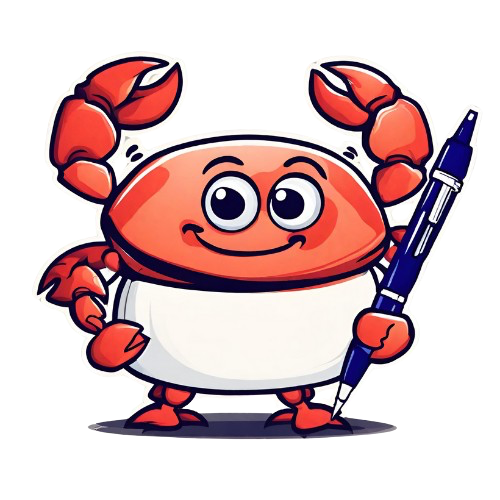
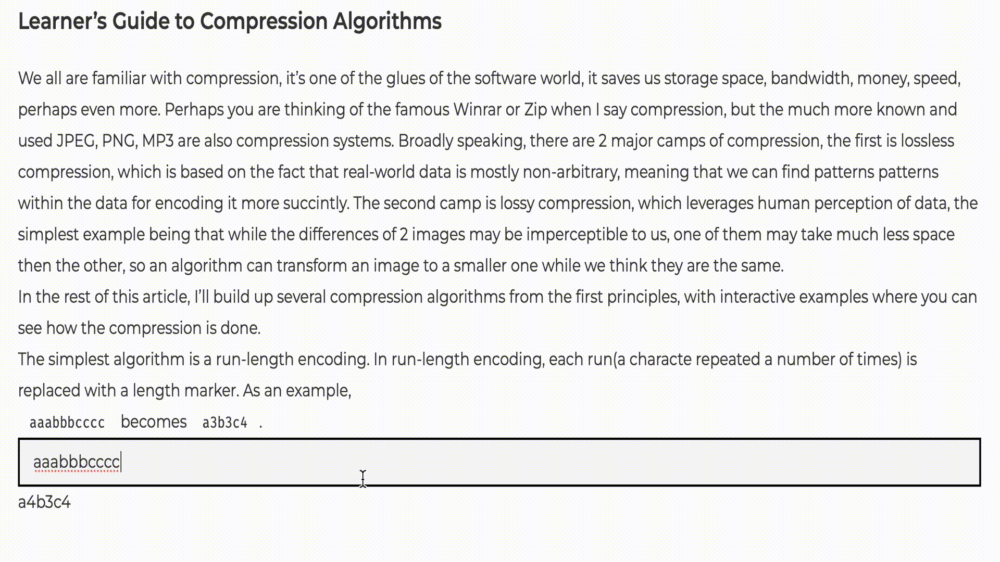

# Devy: Interactive Blog Engine



There are many blogs on the internet, but the best ones I encounter are all interactive. They have code snippets that you can run, modify, and see the results right there. They have quizzes, exercises, and interactive diagrams. They are not just a wall of text, they are a playground where you can learn by doing.

I tried to write my articles interactively, but it was just too much effort per article, so I decided to design a simple declarative language defining the components and
their interactions with each other. The result is DCL(Declarative Component Language) and Devy, a blog engine that renders articles written in DCL.

Devy is implemented as a Pandoc filter using `pandoc_ast` crate. It reads a markdown file, detects DCL snippets written as code blocks, generates the necessary
Javascript code for the interactions and renders the article as a static HTML file.

Below, you can see a Devy in action!



## DCL

DCL is pretty small for now, the only components are `text-input`, `text-area`, `paragraph`, and `radio`. Each component has a name, type, and value, where the value can be a constant or a function of the values of other components. The components can be connected, so that when a component changes, the connected components are updated as well.

Below, you can see a simple example of run-length encoding used in Devy. The first code block is marked as a `script`, meaning that it will be executed in the browser within a `<script>` tag, `show` means that the code will be displayed in the HTML as a code block. The second code block is marked as `dcl`, meaning that it will be parsed by Devy and rendered as a component.


````
```js  {#runLengthEncode .script .show}

const runLengthEncode = (str) => {
    const result = [];

    let currentChar = str[0];
    let currentCount = 1;
    let i = 0

    while(i < str.length) {
        if(str[i] === currentChar) {
            currentCount++;
        } else {
            result.push([currentChar, currentCount]);
            currentChar = str[i];
            currentCount = 1;
        }
        i++;
    }

    result.push([currentChar, currentCount]);

    return result.map(([c, n]) => c + n).join("");
}
```

```dcl
x : text-input := aaabbbcccc
y : text-area := x => runLengthEncode(x)
```
````

The result of the `dcl` block is as follows:

```html
<input type="text"  id="x"  value="aaabbbcccc" ></input>
<script>
    document.getElementById("x").addEventListener('input', function(event) {
    document.getElementById("y").value = runLengthEncode(document.getElementById("x").value)
});
</script>
<textarea id="y" ></textarea>
```

I plan to add more components and features to DCL in the future, such as quizzes, diagrams, and more. The project is all need-based for now, I'll add features as I need them.
in my articles. If you want to be involved, just open an issue or a PR!

## Features

### Declarative Component Language(DCL) Features

- [x] Text Input
- [x] Text Area
- [x] Paragraph
- [x] Radio
- [ ] Checkbox
- [ ] Range
- [ ] Button
- [ ] Switch
- [ ] Custom Styling
- [ ] Custom Components(Allows reusability of CDL blocks)
- [ ] Class Names for Components

### Code Block Features

- [x] Copy Button for Code Blocks
- [x] Line numbers for Code Blocks
    - [ ] Line numbers with offsets
- [ ] Code Running/Echo for Code Blocks(Javascript)
- [ ] Code Running/Echo for Code Blocks(Other languages)
- [ ] File names in Code Blocks

### Article Features

- [x] Mermaid
    - [x] Extended Mermaid with Animations
    - [ ] Custom Styling
- [ ] D2
- [ ] Inline JSX Support
