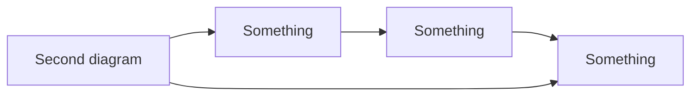

# Introducing Devy, written using Devy!


This blog post introduces [Devy](https://github.com/alpaylan/devy), the interactive 
blog engine I've been working on. Devy is a static site generator that allows you 
to write interactive blog posts using a combination of markdown and a custom DSL.
This post is written using Devy, so you can see how it works in action!

I like to write a lot of small code snippets in my code, and I want my readers to be
able to try them out. Using DCL(Declarative Component Language), I can define components
and their interactions in a simple way. For example, the following code block defines
a function for turning a given string into uppercase:

**If you would like to see what this post looks like without any CSS, check out the [raw HTML](devy.html).**

```js  {#toUpperCase .script .show}
const toUpperCase = (str) => str.toUpperCase();
```

A simple feature, which probably should be the default behavior in the future, is the
ability to copy the code block to the clipboard. The next code block is a simple example
of a function that adds two numbers together:

```js  {#add .script .show .copy}
const add = (a, b) => "Answer is " + (parseInt(a) + parseInt(b));
```

Line numbers are also an important feature(you need a little bit of css to make them look
good). Of course, we are not always limited to Javascript, so here's a Rust version of
the `add` function.

<style>
    .line-numbers {
        display: inline-block;
        margin-right: 10;
        padding: 0;
    }
</style>

```rust  {#add-rs .show .linenumbers}
fn add(a: i32, b: i32) -> i32 {
    a + b
}
```

That's all pretty cool, but nothing impressive. The fun starts when you can run
code snippets and use their results. That's where DCL comes into play. Below is
a short DCL snippet that uses the `add` function to add two numbers together.
The first two lines define the inputs and their initial values, and the third
line defines the output as a function of the result of adding the two inputs together.

````
```dcl {#add-example}
input1 : text-input := 5
input2 : text-input := 10
output : text-area := input1, input2 => add(input1, input2)
```
````

Devy compiles this DCL snippet into HTML and Javascript code that updates
the output whenever the inputs change as you can see below:

```dcl {#add-example}
input1 : text-input := 5
input2 : text-input := 10
output : text-area := input1, input2 => add(input1, input2)
```

Text inputs are not the only components available. Here's an example of a
radio button that asks a question and provides feedback based on the answer:


**Do you think Devy is a cool project?**

```dcl {#radio-example}
option : radio := yes, no, of course
feedback : paragraph := option => option === "of course" ? "Great job!" : "Incorrect! Try Again!"
```

<details>
  <summary>Click to see the CDL code for the question!</summary>

````
```dcl {#radio-example}
option : radio := yes, no, of course
feedback : paragraph := option => option === "of course" ? "Great job!" : "Incorrect! Try Again!"
```
````

</details>

Aside from interactivity, I also want to focus on easily creating diagrams
and other visualizations. For now, I started with 
the [Mermaid](https://mermaid.js.org) diagrams, which are simple to write
 and look great. Here's an example of a simple flowchart:




One cool thing I added(which doesn't exist natively in Mermaid) is
animating the diagrams. Users can easily add a `rate` attribute to
the mermaid code block to control the animation speed. For example,
the following diagram animates at a rate of 1000ms:


The current animation system is pretty simple, but I plan to add (1) phase-based
animations where user can define the frame each element should appear, (2) control
mechanisms for animations such as dynamic speed control, and (3) layout preserving
animation where all elements do not destructively move around.

That concludes the current state of Devy. It's a brand new project, and there are
lots of features I want to add. If you have any ideas, please let me know by opening
an issue on the [GitHub repository](https://github.com/alpaylan/devy). I'm excited
to see where this project goes, and I hope you are too! Also, please leave a star
on the repository if you like the project!

**Repository Link:** [https://github.com/alpaylan/devy](https://github.com/alpaylan/devy)

## Appendix

Below is the Markdown code for all of this article.

`````
# Introducing Devy, written using Devy!


This blog post introduces [Devy](https://github.com/alpaylan/devy), the interactive 
blog engine I've been working on. Devy is a static site generator that allows you 
to write interactive blog posts using a combination of markdown and a custom DSL.
This post is written using Devy, so you can see how it works in action!

I like to write a lot of small code snippets in my code, and I want my readers to be
able to try them out. Using DCL(Declarative Component Language), I can define components
and their interactions in a simple way. For example, the following code block defines
a function for turning a given string into uppercase:

**If you would like to see what this post looks like without any CSS, check out the [raw HTML](devy.html).**

```js  {#toUpperCase .script .show}
const toUpperCase = (str) => str.toUpperCase();
```

A simple feature, which probably should be the default behavior in the future, is the
ability to copy the code block to the clipboard. The next code block is a simple example
of a function that adds two numbers together:

```js  {#add .script .show .copy}
const add = (a, b) => "Answer is " + (parseInt(a) + parseInt(b));
```

Line numbers are also an important feature(you need a little bit of css to make them look
good). Of course, we are not always limited to Javascript, so here's a Rust version of
the `add` function.

<style>
    .line-numbers {
        display: inline-block;
        margin-right: 10;
        padding: 0;
    }
</style>

```rust  {#add-rs .show .linenumbers}
fn add(a: i32, b: i32) -> i32 {
    a + b
}
```

That's all pretty cool, but nothing impressive. The fun starts when you can run
code snippets and use their results. That's where DCL comes into play. Below is
a short DCL snippet that uses the `add` function to add two numbers together.
The first two lines define the inputs and their initial values, and the third
line defines the output as a function of the result of adding the two inputs together.

````
```dcl {#add-example}
input1 : text-input := 5
input2 : text-input := 10
output : text-area := input1, input2 => add(input1, input2)
```
````

Devy compiles this DCL snippet into HTML and Javascript code that updates
the output whenever the inputs change as you can see below:

```dcl {#add-example}
input1 : text-input := 5
input2 : text-input := 10
output : text-area := input1, input2 => add(input1, input2)
```

Text inputs are not the only components available. Here's an example of a
radio button that asks a question and provides feedback based on the answer:


**Do you think Devy is a cool project?**

```dcl {#radio-example}
option : radio := yes, no, of course
feedback : paragraph := option => option === "of course" ? "Great job!" : "Incorrect! Try Again!"
```

<details>
  <summary>Click to see the CDL code for the question!</summary>

````
```dcl {#radio-example}
option : radio := yes, no, of course
feedback : paragraph := option => option === "of course" ? "Great job!" : "Incorrect! Try Again!"
```
````

</details>

Aside from interactivity, I also want to focus on easily creating diagrams
and other visualizations. For now, I started with 
the [Mermaid](https://mermaid.js.org) diagrams, which are simple to write
 and look great. Here's an example of a simple flowchart:


One cool thing I added(which doesn't exist natively in Mermaid) is
animating the diagrams. Users can easily add a `rate` attribute to
the mermaid code block to control the animation speed. For example,
the following diagram animates at a rate of 1000ms:


The current animation system is pretty simple, but I plan to add (1) phase-based
animations where user can define the frame each element should appear, (2) control
mechanisms for animations such as dynamic speed control, and (3) layout preserving
animation where all elements do not destructively move around.

That concludes the current state of Devy. It's a brand new project, and there are
lots of features I want to add. If you have any ideas, please let me know by opening
an issue on the [GitHub repository](https://github.com/alpaylan/devy). I'm excited
to see where this project goes, and I hope you are too! Also, please leave a star
on the repository if you like the project!

**Repository Link:** [https://github.com/alpaylan/devy](https://github.com/alpaylan/devy)
`````