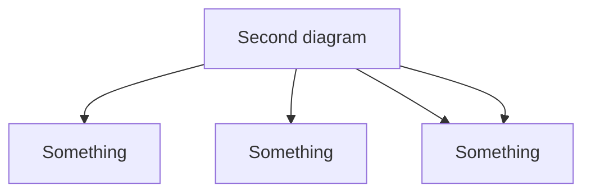
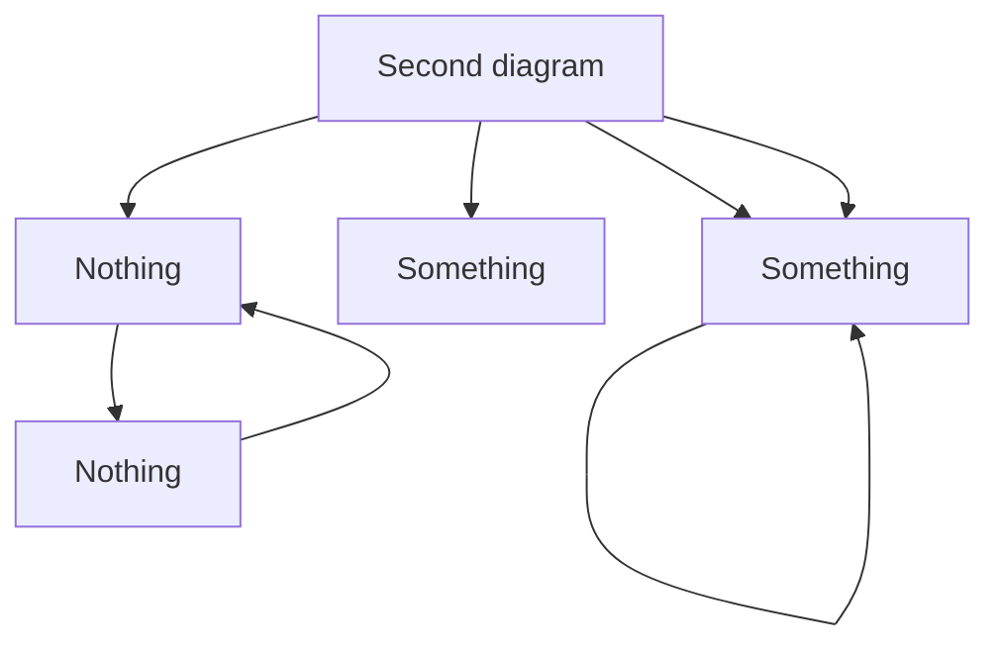

# Learner's Guide to Compression Algorithms

We all are familiar with compression, it's one of the glues of the software world,
it saves us storage space, bandwidth, money, speed, perhaps even more. Perhaps you
are thinking of the famous Winrar or Zip when I say compression, but the much more
known and used JPEG, PNG, MP3 are also compression systems. Broadly speaking, there
are 2 major camps of compression, the first is lossless compression, which is based
on the fact that real-world data is mostly non-arbitrary, meaning that we can find
patterns patterns within the data for encoding it more succintly. The second camp
is lossy compression, which leverages human perception of data, the simplest example
being that while the differences of 2 images may be imperceptible to us, one of them
may take much less space then the other, so an algorithm can transform an image to
a smaller one while we think they are the same.

In the rest of this article, I'll build up several compression algorithms from the
first principles, with interactive examples where you can see how the compression is done.

The simplest algorithm is a run-length encoding. In run-length encoding, each 
run(a characte repeated a number of times) is replaced with a length marker. As an example,

`aaabbbcccc` becomes `a3b3c4`. 

```js  {#runLengthEncode .script .show .copy .linenumbers}

const runLengthEncode = (str) => {
    const result = [];

    let currentChar = str[0];
    let currentCount = 1;
    let i = 0

    while(i < str.length) {
        if(str[i] === currentChar) {
            currentCount++;
        } else {
            result.push([currentChar, currentCount]);
            currentChar = str[i];
            currentCount = 1;
        }
        i++;
    }

    result.push([currentChar, currentCount]);

    return result.map(([c, n]) => c + n).join("");
}
```

<details>
  <summary>Click me</summary>

```dcl
x : text-input := aaabbbcccc
y : text-area := x => runLengthEncode(x)
```

</details>

Question time! Is run-length encoding a lossless or lossy compression algorithm?[^1]

```dcl
option : radio := lossless, lossy
feedback : paragraph := option => option === "lossless" ? "Correct! Run-length encoding is a lossless compression algorithm." : "Incorrect! Run-length encoding is a lossless compression algorithm."
```






[^1]: This is a footnote
